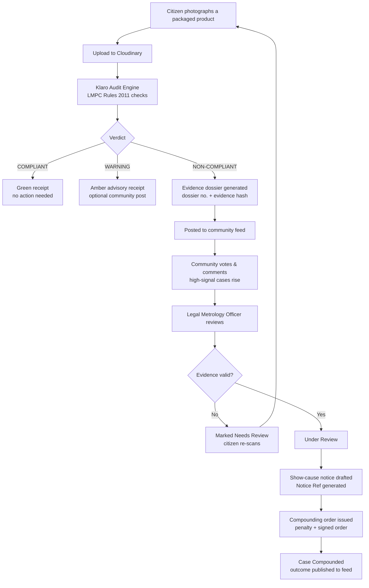
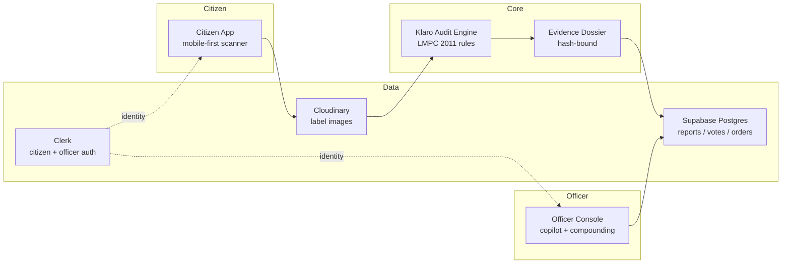
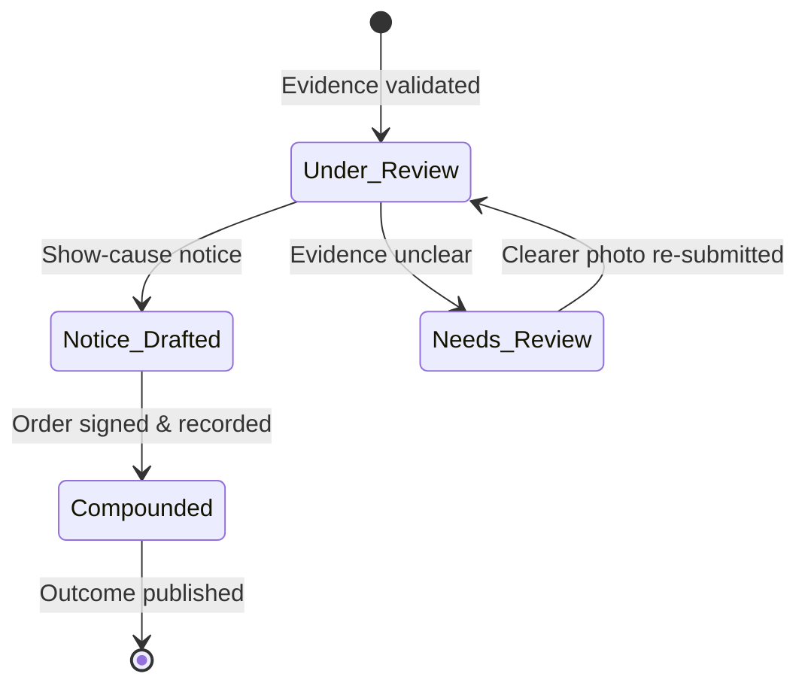
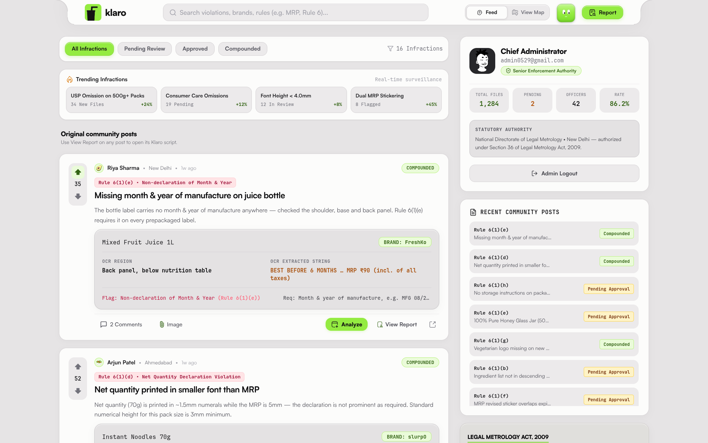
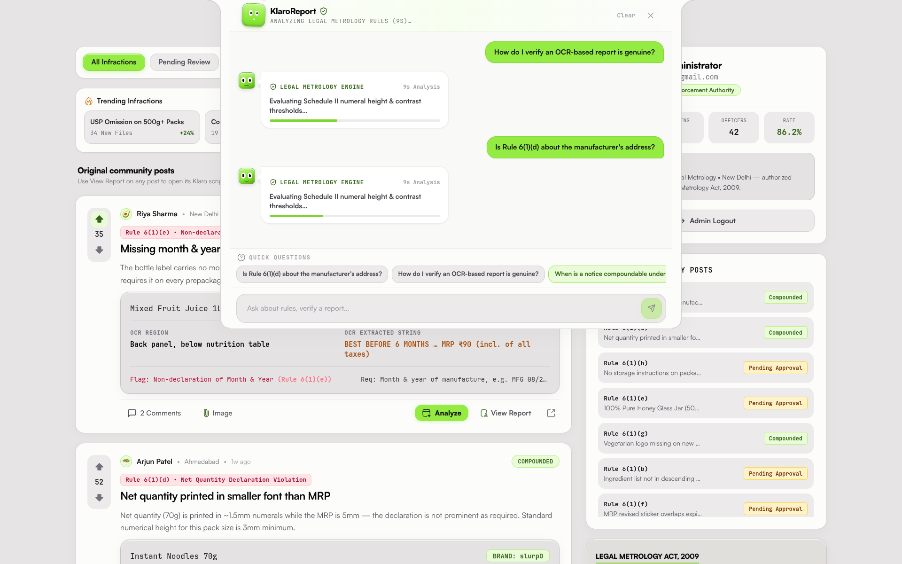
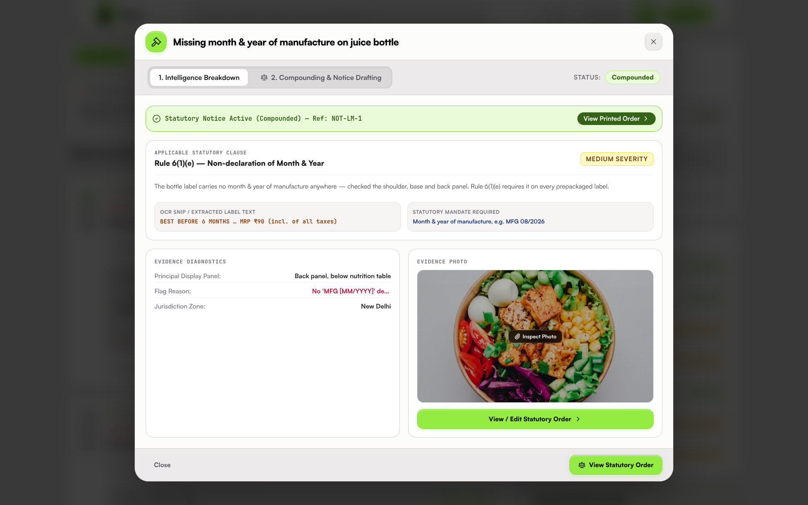
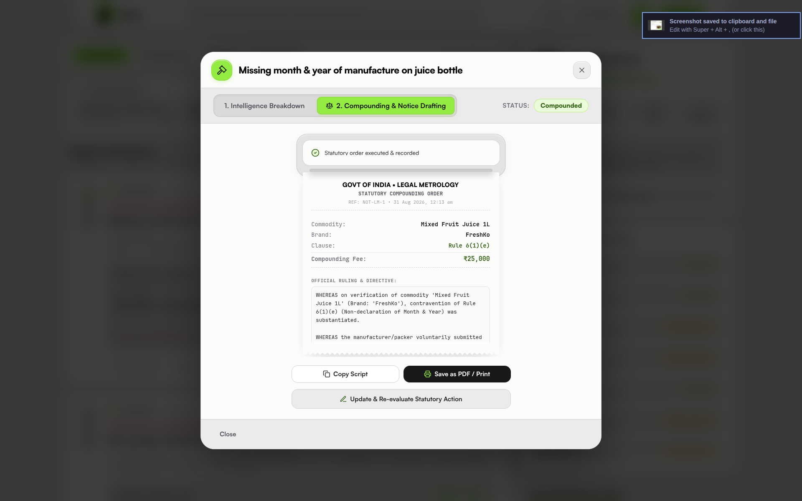
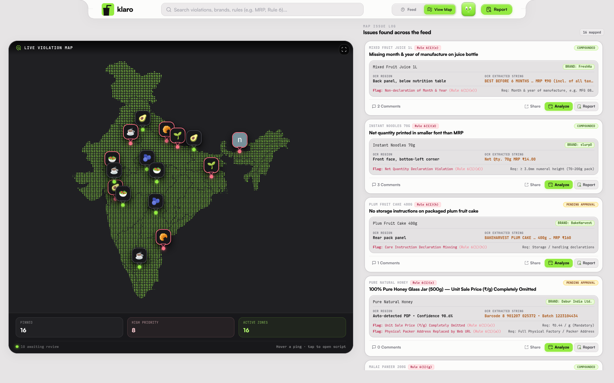

# Klaro

### AI-Powered Packaged-Food Label Scanner & Legal Metrology Enforcement Platform

**Scan a label. Verify it against Indian law. Drive it to enforcement.**

Klaro lets any citizen photograph a packaged product and have it instantly audited against the **Legal Metrology (Packaged Commodities) Rules, 2011**. Verified violations are posted to a public, community-scored feed and flow directly to a Legal Metrology Officer console — where they become show-cause notices and digitally signed **compounding orders**. Every step is public, hash-linked, and tamper-evident.

> Think of it as an always-on *legal-metrology inspector* + a community that *votes violations up* + a *tamper-evident evidence ledger* — in one mobile-first platform.

---

## Table of Contents

- [Features](#features)
- [How It Works](#how-it-works)
- [Screenshots](#screenshots)
- [Tech Stack](#tech-stack)
- [Project Structure](#project-structure)
- [Getting Started](#getting-started)
- [Environment Variables](#environment-variables)
- [Evidence Integrity](#evidence-integrity)
- [Roadmap](#roadmap)

---

## Features

### Citizen Experience
- **Label Scanner** — photograph or upload any packaged product; the receipt-style scan flow animates through analysis and prints a verdict.
- **Instant Legal Audit** — the Klaro Audit Engine checks 8+ declarations against **LMPC Rules 2011**: MRP (inclusive of all taxes), unit sale price, net quantity, numeral font heights (Rule 7 / Schedule II), manufacturer address, consumer-care details, and country of origin.
- **Receipt-style Verdicts** — results render as a tactile receipt: `COMPLIANT`, `WARNING`, or `NON-COMPLIANT`, with the exact rule cited.
- **One-tap Complaints** — verified violations are posted with their evidence dossier in a single tap.

### Community Verification
- **Public Feed** — every complaint is visible with its evidence image, OCR snippet, measured-vs-required values, and legal citation.
- **Crowdsourced Triage** — upvotes, downvotes, comments, and sharing surface genuine violations and demote weak evidence.
- **India Violation Map** — pixel/vector map of India (`@svg-maps/india`) plots live non-compliance by zone.
- **Filters** — commodity, severity, and zone filtering to find what matters.

### Enforcement (Officer Console)
- **Enforcement Dashboard** — live stats: pending review, trending infractions, in-review counts, approved and compounded cases.
- **Intelligence Breakdown** — per-case review of the statutory clause, OCR snippet, measured vs required values, severity, and applicable rule.
- **Officer Copilot** — an in-app assistant answers MRP, font-size, OCR-verification, and penalty-section questions in plain language.
- **Notice Drafting & Compounding** — draft show-cause notices and issue statutory compounding orders with penalty amount, section code, notice reference, and a digitally hashed officer signature.
- **Printed Statutory Orders** — a formal *"Govt of India · Legal Metrology · Statutory Compounding Order"* document for records.

### Authentication & UX
- **Clerk-backed auth** — email/password, Google / GitHub / Apple OAuth, email verification, password recovery, and profile onboarding.
- **Officer / Admin login** — dedicated legal-metrology access portal.
- **Tactile design system** — warm off-white surface, charcoal ink, botanical green accents, physics-based `framer-motion` transitions, and a living mascot (KlaroBot) that blinks, tracks, and reacts to typing.

---

## How It Works

### End-to-End Complaint Lifecycle



### Architecture



### Case Status Lifecycle



### The Evidence Chain

Every dossier binds five artifacts so nothing can be silently altered after filing:

```
Label image  →  OCR snippet  →  measured vs required value  →  legal citation  →  officer signature hash
```

Each post carries a dossier number, evidence hash, confidence score, and a full trace back to the source image.

---

## Screenshots

### Officer Enforcement Dashboard
Live statistics on pending review, trending infractions, and case statuses across the feed.



### Legal Metrology Audit Analysis
The audit engine running legal-metrology rule checks — numeral height and contrast thresholds, Schedule II evaluations, and officer rating.



### Case Review & Notice Drafting
Intelligence breakdown of a compounded case — statutory clause `Rule 6(1)(e)`, severity, OCR snippet, and the active notice reference.



### Statutory Compounding Order
The digitally recorded compounding order for a mixed-fruit-juice violation, with commodity, brand, clause, and penalty.



### Community Feed & Violation Map
A verified violation post on the community feed alongside the India map of mapped infractions.



---

## Tech Stack

| Layer | Technology |
| --- | --- |
| Framework | Next.js 16 (App Router, Server Actions, API Routes) |
| UI | React 19, TypeScript, Tailwind CSS 3, framer-motion, lucide-react |
| Auth | Clerk (`@clerk/nextjs`) — citizens & officers |
| Database | Supabase (PostgreSQL + service-role server actions) |
| Media | Cloudinary (label evidence uploads) |
| Intelligence | Klaro Audit Engine (LMPC 2011 rule engine), Officer Copilot |
| Maps | @svg-maps/india, canvas-confetti |
| Runtime | Bun, Vercel deployment |

---

## Project Structure

```
src/
├── actions/
│   ├── profile.ts            # Profile read/write via service-role Supabase
│   └── reports.ts            # Reports, votes, comments, compounding orders
├── app/
│   ├── admin/page.tsx        # Officer enforcement console
│   ├── api/
│   │   ├── admin-assistant/  # Officer copilot (plain-language Q&A)
│   │   ├── download/         # Source archive download
│   │   └── telemetry/        # Install telemetry endpoint
│   ├── check/page.tsx        # Interactive UX / state explorer
│   ├── dashboard/page.tsx    # Community feed + scan + map
│   ├── login/page.tsx        # Auth orchestrator (Clerk + officer login)
│   ├── sso-callback/         # OAuth callback
│   └── layout.tsx
├── components/
│   ├── admin/                # Post map, analyze modal, copilot panel
│   ├── auth/                 # Auth forms, KlaroBot mascot, officer login
│   ├── community/            # India map, scatter, comments
│   ├── landing/              # Marketing sections (hero, scan demo, impact)
│   ├── scan/                 # ScanFlow + ReceiptPrinter
│   └── ui/                   # Button, Input, Logo, Badge, TactileCard
├── lib/
│   ├── auditEngine.ts        # LMPC compliance rule engine
│   ├── supabase.ts           # Supabase clients
│   └── cloudinary.ts         # Evidence uploads
└── middleware.ts             # Route protection (Clerk + app session)
```

---

## Getting Started

### Prerequisites
- [Bun](https://bun.sh) `>= 1.x`
- Clerk, Supabase, and Cloudinary accounts (free tiers)

### Install & Run

```bash
# 1. Install dependencies
bun install

# 2. Configure environment (see table below)
cp .env.local.example .env.local

# 3. Run the dev server
bun run dev        # → http://localhost:3000

# Production build
bun run build && bun run start
```

Key routes:

| Route | Purpose |
| --- | --- |
| `/` | Redirects to login |
| `/login` | Authentication (Clerk + officer access) |
| `/dashboard` | Community feed, scanner, India map |
| `/admin` | Officer enforcement console |
| `/check` | UX state explorer / design playground |

---

## Environment Variables

| Variable | Purpose |
| --- | --- |
| `NEXT_PUBLIC_CLERK_PUBLISHABLE_KEY` | Clerk frontend key |
| `CLERK_SECRET_KEY` | Clerk backend key |
| `NEXT_PUBLIC_SUPABASE_URL` | Supabase project URL |
| `NEXT_PUBLIC_SUPABASE_ANON_KEY` | Supabase anon/publishable key |
| `SUPABASE_SERVICE_ROLE_KEY` | Supabase service-role key (server only) |
| `CLOUDINARY_UPLOAD_PRESET` | Cloudinary unsigned upload preset |

> **Security:** `.env*.local` is gitignored. Keep the service-role key and Clerk secret out of any public repository, and rotate them if they are ever exposed.

---

## Evidence Integrity

- Every scan produces a **dossier number** and **evidence hash**.
- Measured and required values are recorded per declaration alongside the **exact legal citation**.
- Compounding orders carry a **notice reference**, section code, penalty, and an **officer signature hash**.
- Case statuses — `Under Review → Notice Drafted → Compounded` — are public on the feed so complainants can follow their case to closure.

---

## Roadmap

- Live OCR backend for real label reading (the current engine is rule-based on simulated OCR output).
- Official-role mapping in Clerk for multi-level enforcement (state / central controllers).
- Hindi + regional language support for the scanner and feed.
- WhatsApp / email case notifications for complainants.
- Bulk import & API for FBO (food business operator) label submissions.

---

Built for **Smart India Hackathon 2026** — an AI-powered public-interest platform for Legal Metrology compliance.
